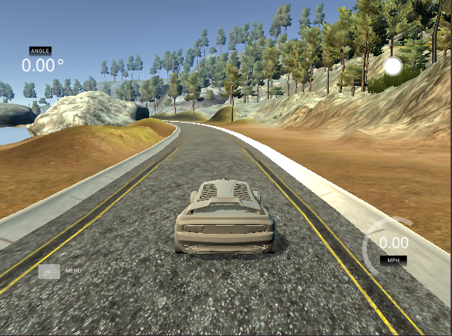
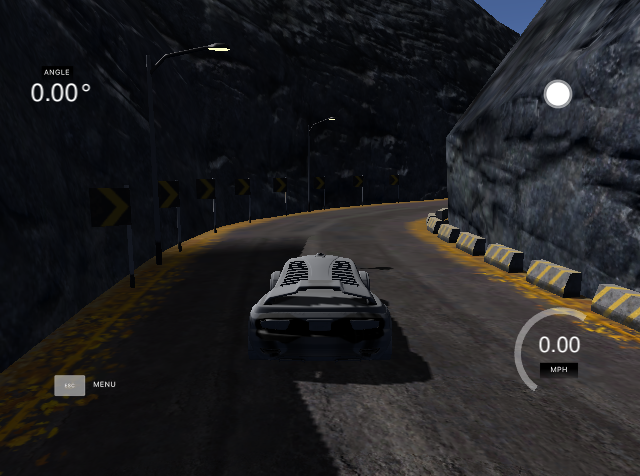

# Design:

## Model Design:

The model is similar to the model developed for <a href="https://github.com/neerajdixit/ND/tree/master/Traffic%20Sign%20classifier%20with%20Deep%20Learning">other project</a> since in both the projects the model looks at an image and produces a label, the only difference being, that this project has single output label compared to 43 in the previous one.

With my already pretrained network(NDNet) I just had to add and additional Fully connected layer at the end to get single output and make it work for this task.

Tested NDNet after adding a final FC layer to it. This gave promising results and so decided to build on it. Also this model gave better performance with far less trainable parameters compared to other architecture which resulted in less training time.

The model was further tweaked by adding a dropout layer to avoid overfitting. The final dropout layer position and fraction was reached by trial and error. Tested with multiple dropout layers in different positions and fraction values and used the one that gave best results.

Initially a minmax normalization was used as part of the image preprocessing to give the model fairly consistent images(in terms of contrast and pixel intensity) to learn and detect this strategy worked well for the two tracks but wasn't enough for images with higher resolutions. To overcome this a normalization layer was added to the beginning of the mode

## Image Preprocessing:

All the images training/validation go through the same preprocessing pipeline before going to the model. Below is the strategy used.

1. Crop the images and only keep the track part of the image as the other parts are not really import and gives unwanted feature for model to learn which are not important for steering predictions and might introduce errors. Top 40% is cropped out to remove sky,hills, trees etc and bottom 15% to remove car.

2. Normalize the image to mitigate differences due to light condition across the data set. Also useful for different tracks.

3. Convert the image to HSV colors pace. This is done because HSV gives separate intensity and color informations which work better for the tasks like these and are more suitable for intensity normalization.

4. Resize the image to 32x32 because our network expects that input

# Architecture:

The final architecture is similar to VGGNet with two conv-pool layers followed by three fully connected layers. Apart from this there is a normalization layer at the beginning for intensity normalization and a dropout layer between flatten and first fully connected layer

Two conv-pool layers are used because of small image size and because adding more layers with SAME padding(to not reduce the image size too quickly) had no sizable improvement in performance.

Adding a dropout layer between the flatten layer and first fully connected layer helps not overfitting.

Testing showed that increasing depth/number of filter in a consistent manner with small steps in conv layers before a polling operation produced better results compared to bigger/sudden changes in conv layer. In fact the accuracy goes down if the depth is increased too rapidly.

Below is the model summary.

<pre>

Layer (type)                     Output Shape          Param #     Connected to                     
====================================================================================================
norm (Lambda)                    (None, 32, 32, 3)     0           lambda_input_1[0][0]             
____________________________________________________________________________________________________
conv1 (Convolution2D)            (None, 30, 30, 6)     168         norm[0][0]                       
____________________________________________________________________________________________________
conv2 (Convolution2D)            (None, 28, 28, 9)     495         conv1[0][0]                      
____________________________________________________________________________________________________
pool1 (MaxPooling2D)             (None, 14, 14, 9)     0           conv2[0][0]                      
____________________________________________________________________________________________________
conv3 (Convolution2D)            (None, 12, 12, 12)    984         pool1[0][0]                      
____________________________________________________________________________________________________
conv4 (Convolution2D)            (None, 10, 10, 16)    1744        conv3[0][0]                      
____________________________________________________________________________________________________
pool2 (MaxPooling2D)             (None, 5, 5, 16)      0           conv4[0][0]                      
____________________________________________________________________________________________________
flat1 (Flatten)                  (None, 400)           0           pool2[0][0]                      
____________________________________________________________________________________________________
dropout1 (Dropout)               (None, 400)           0           flat1[0][0]                      
____________________________________________________________________________________________________
fc1 (Dense)                      (None, 220)           88220       dropout1[0][0]                   
____________________________________________________________________________________________________
fc2 (Dense)                      (None, 43)            9503        fc1[0][0]                        
____________________________________________________________________________________________________
fc3 (Dense)                      (None, 1)             44          fc2[0][0]                        
====================================================================================================
Total params: 101,158
Trainable params: 101,158
Non-trainable params: 0
____________________________________________________________________________________________________
</pre>

# Training dataset:

Training data is collected by driving the car on simulator track 1. All the images from center,left and right camera were used giving a total of 24108 images. The data only contains the image locations and steering angles, the real image data is generated by the generators. 

To create the dataset first the image locations of the center camera is put in a numpy array and the corresponding steering angles in another.

Next, the image locations from the left camera are appended to the image array. To get the corresponding steering angles, 0.25 is added to the corresponding original angles and the result is appended to the steering angle array.

Finally, the image locations from the right camera are appended to the image array and to get the corresponding steering angles, 0.25 is subtracted from the corresponding original angles and the result is appended to the steering angle array.

Above approach helps the model train for recovery. The value to add/subtract was decided after testing from 0.10 to 0.30 and the one that gave best performance was chosen.

The two arrays image location array and steering angles array are shuffled and 10% of all the data is randomly chosen upfront as validation set. 10% because the validation on the real simulation was more accurate and the validation during training wasn't very accurate or helpful.

Final number of training examples = 21697

Final number of validation examples = 2411

# Training process:

To train the model, fit_generator function from keras is used.

Same generator function is used for both the train data and validation data generator. It takes in the image locations array, steering angles array, folder path containing images and the batch size.

First the generator randomly select the steering angles equal to the batch size. These could be for center, left or right image. Then the corresponding image location is selected and image is read from the disk and preprocessed as discussed in the preprocessing above and returns the batch of image data and steering angles.

The final values of

batch size = 256
epochs = 10
samples per epochs = 8064

were reached after some trial and error.

Since this model is built on the model I developed for last project, the initial values for all parameters were taken from that model i.e 400, 40 and length of the train data respectively. This was then tweaked after few iterations to suit this model and best results.

Learning rate is kept the same, which is 0.001

batch size for validation generator is same as train generator and the validation data for used for validation. This approach appeared most stable and produced better results.

# Autonomous Driving on track 1

# Autonomous Driving on track 2 which the model has not seen before

